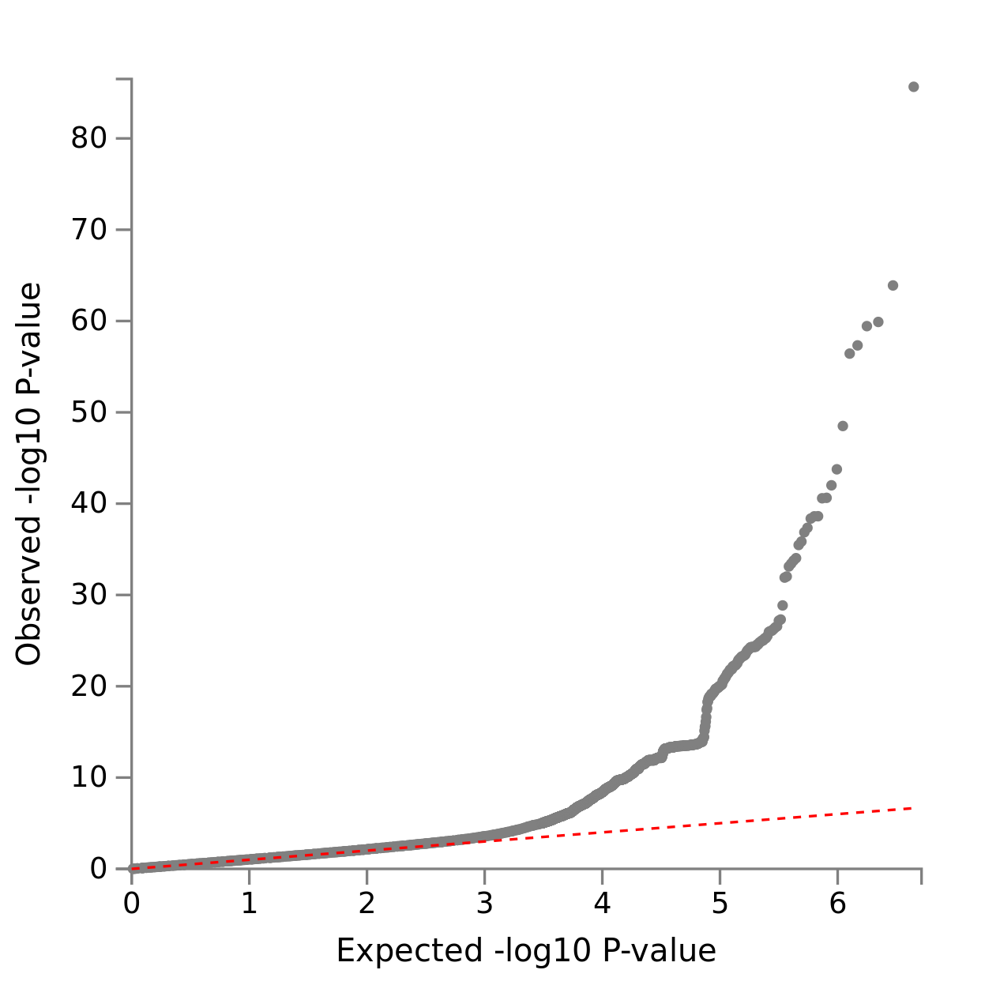
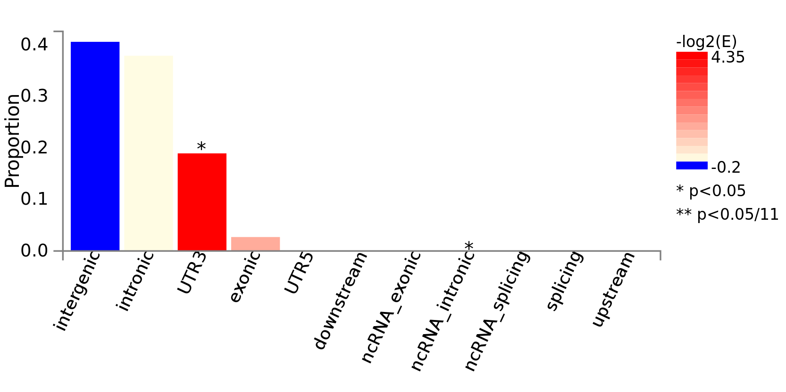
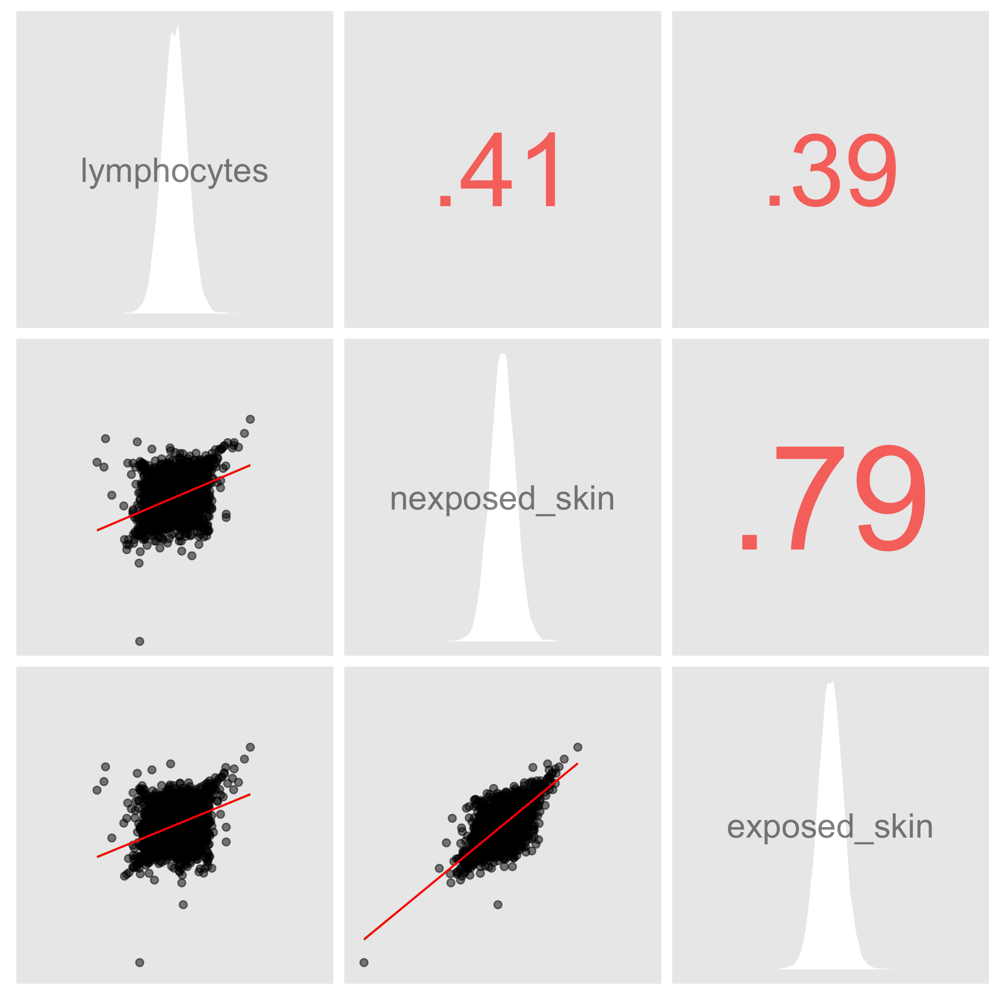
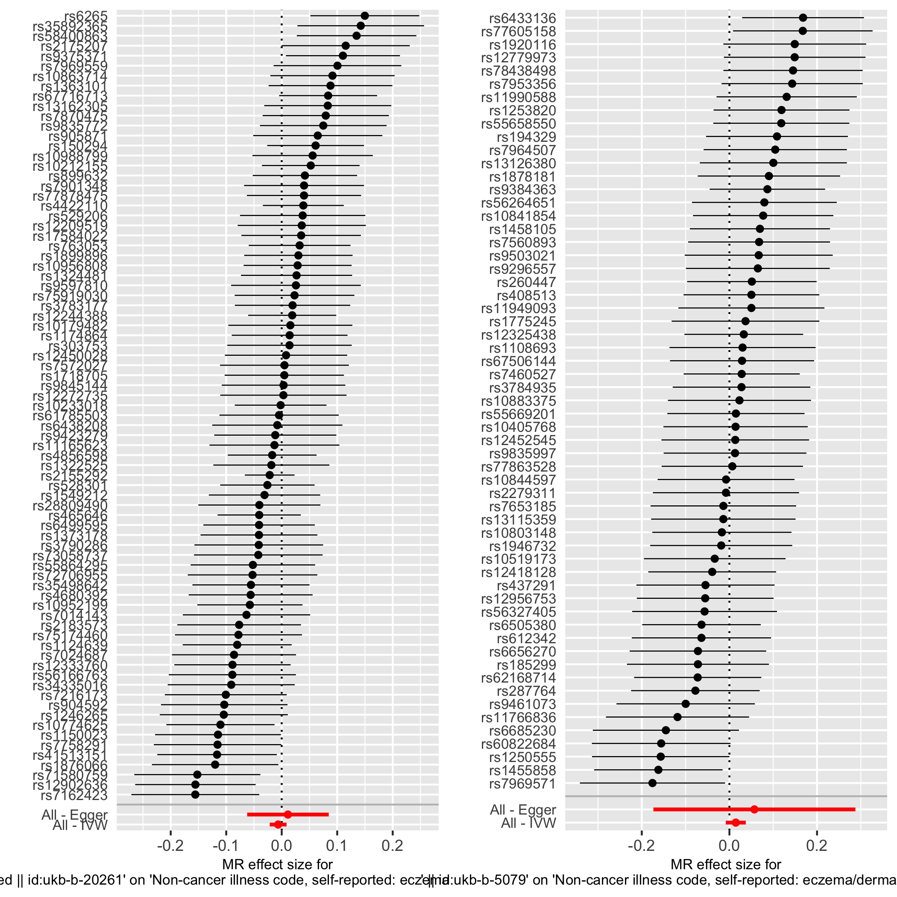

```{r , message=FALSE, result='hide', echo = FALSE}
library(tidyverse)
#library(ggplot2)
#library(TwoSampleMR)
#library(ez)
library(kableExtra)
#library(grid)
#library(gridExtra)
```

# Analyzing Dermatitis/eczema from the UK Biobank GWAS

## Abstract
Eczema is a group of skin diseases affecting roughly 20% of populuations without cure currently. To further the understanding of genetic and environmental causes of eczema, I utilized genome-wide association study summary statistics from the UK BioBank. From gene-set enrichment analysis and variant annotation, I show that variants in the 17 independent loci reaching genome-wide significance are enriched in genes related to immune responses and epidermal functions. In addition, while previous studies suggested environmental factors such as exposure to smoke and vitanim D deficiency can induce eczema, I observe no association between these two factors and the disease status.


## Introduction
Eczema (Dermatitis) is a group of inflammatory skin diseases that cause redness, itchiness and rritation. It affects 15%-20% of populations (@Paternoster2015). Its pathogenesis includes skin barrier dysfunction and cell mediated immune response. Environmental factors such as vitamin D deficiency, humidity and exposure to smoke and detergent have been proposed as (@Kantor2016, @Mesquita2013). Multiple studies have performed genome wide association stuies (GWAS) on eczema, with variants in the *FLG* gene showing the strongest signals. Despite its prevalence there currently is no cure for eczema. Moreover, interpretation for genome-wide significant variants are usually not obvious. Recent effort on Biobank establishment has enabled large-scaled association studies with electronic health record. In this paper, I utilized recently developed computational methods that require only summary statistics for post-GWAS analyses to further the understanding of eczema. I performed gene-set enrichment analysis for genes whose imputed expression is strongly associated with the disease status. I also investigated environmental risk factors with Mendelian randomization.

## Result
### Manhattan plot with LocusZoom
Pre-harmonized GWAS summary statistics is publicly available from the MRC-IEU UK Biobank GWAS pipeline. The self-reported eczema GWAS consists of 337119 individuals with 8718 cases. I first visualized associations between self-reported eczema status and each genetic variant with a Manhattan plot (Fig. \ref{fig:manhattan}). The most significant variant rs61816761 (1:152313385_G/A, $-10\log_{10}p = 85.6$) is a loss-of-function mutation in the *FLG* gene, which encodes the protein profilaggrin that constitutes the epidermis, and has been frequenctly reported in eczema studies. Another variant rs3093553 (6:31581779_T/G $-10\log_{10}p = 13.09$) is a mutation in the *LBT* gene, which is linked to lymploid development and imflammotory response (NCBI Entrez gene entry).

```{r manhattan, echo=FALSE, out.width="70%", out.height="70%", fig.cap="Manhattan plot (top), Locuz zoom plot of rs61816761 (bottom)", fig.show='hold', fig.align='center'}
knitr::include_graphics(c("../figs/manhattan.png","../figs/top_locus.png","../figs/second_locus.png"))
```

### Population structure
It is concerning whether deviations from the expected p-values at the upper tail are caused by population structure (Fig. \ref{fig:qqplot}). LD-score regression, which regresses $\chi^2$ statistics of a variants against its ld-score, differentiates polygenicity from population stratification by testing if the resulting intercept differs from 1. With 1000 Genome Project European individual as a LD reference panel, the inferred intercept is 1.0102 (s.e. = 0.0067), suggesting polygenicity rather than population structure.

```{r qqplot, echo=FALSE, out.width="30%", out.height="30%", fig.cap="QQplot for Dermatitis", fig.show='hold',fig.align='center'}

```

### Functional annotation
Variants achieving genome-wide significance from GWAS usually suffer from poor interpretability. I performed functional annotation and visualization with a web application FUMA. There are four lead SNPs reported that had passed the p-value threshold ($5\times10^{-6}$) and independent from each other ($r^2$ threshold 0.1) (Table \ref{tab:leadSNPs}). The significant variants are enriched in UTR3 regions (Fig. \ref{fig:f_consequence}). At gene-levels, there are only two genes reaching genome-wide significance: MAP4K4 and FSTL4, and MAP4KA has been linked to inflammation. 

```{r f_consequence, echo=FALSE, out.width="30%", out.height="30%", fig.cap="functional consequences of candidate SNPs", fig.show='hold',fig.align='center'}

```

```{r leadSNPs, echo=FALSE, message=FALSE}
read_tsv('../output/leadSNPs.txt') %>%
  select(uniqID, rsID, chr, pos, p) %>%
  kable('latex', col.names = c("unique ID", "rsID", "chromosome", "position", "p-value") ,
        caption = "lead SNPS from FUMA", booktabs=TRUE ) %>%
  row_spec(1:4, hline_after = F) %>%
  kable_styling(latex_options = c("hold_position"))
```

## S-Predixcan and gene set enrichment analysis
In addition, I used S-predixcan, which tests for association between imputed expression-level of genes and trait values requiring only summary statistics. Skin tissues and lymphocytes are especially of interest here since studies have suggested correlation between eczema and other immune responses. Inferred z-scores from the three tissue types are highly correlated (Fig. \ref{fig:corr}). The *TNXB* gene is statistically significant across these tissues (Z > 6), and it regulates the production of collagen. Multiple genes in the *LCE* complex are the most significant as well, and they regulate epidermal differentiation. In addition, I ran gene set enrichment analysis (GSEA) through the web application `WebGestalt`. Interleukin-17 production, response to epidermal growth factor, fluid transport are enriched among GO terms under biological processes with the skin tissue results (Fig. \ref{fig:GSEA}), while the lymphocyte results did not produce any significant terms.

```{r corr_code, eval=FALSE, echo=FALSE, warning=FALSE, message=FALSE} 
lymph <- read_csv('../output/spredixcan.UKB_dermatitis.Cells_EBV-transformed_lymphocytes.csv')
ns_skin <- read_csv('../output/spredixcan.UKB_dermatitis.Skin_Not_Sun_Exposed_Suprapubic.csv')
s_skin <- read_csv('../output/spredixcan.UKB_dermatitis.Skin_Sun_Exposed_Lower_leg.csv')

zscores <- select(lymph, lymphocytes = zscore, gene) %>%
  inner_join(select(ns_skin, nexposed_skin = zscore, gene)) %>%
  inner_join(select(s_skin, exposed_skin = zscore, gene))

p <- zscores %>% 
  select(-gene) %>%
  ezCor(label_size = 6)

ggsave('../figs/corr.png', p)
```

```{r corr, echo=FALSE, warning=FALSE, message=FALSE, out.width="60%", fig.align="center", fig.cap = "correlation of Z-scores from genes computed by S-prediXcan between each tissue type"}

```


```{r GSEA, echo=FALSE, out.width="50%", out.height="50%", fig.ncol = 2, fig.cap="GSEA: skin sun exposed, GSEA: skin sun unexposed", fig.show='hold', fig.align='center'}
knitr::include_graphics(c("../figs/GSEA_skin_exposed.png","../figs/GSEA_skin_unexposed.png"))
```


```{r MR_code, eval=FALSE, warning=FALSE, echo=FALSE}
ao <- available_outcomes()
# 20261 - ever smoked, 5079 - vitamin D.
smoke_dat <- extract_instruments(outcomes='ukb-b-20261')
vitaminD_dat <- extract_instruments(outcomes='ukb-b-5079', p1 = 1e-4)
out_smoke_dat <- extract_outcome_data(snps = smoke_dat$SNP, outcomes = 'ukb-b-20141') 
out_vitaminD_dat <- extract_outcome_data(snps = vitaminD_dat$SNP, outcomes = 'ukb-b-20141') 

dat_smoke <- harmonise_data(smoke_dat, out_smoke_dat)
dat_vitaminD <- harmonise_data(vitaminD_dat, out_vitaminD_dat)

res_single <- mr_singlesnp(dat_smoke)
p1 <- mr_forest_plot(res_single)
res_single2 <- mr_singlesnp(dat_vitaminD)
p2 <- mr_forest_plot(res_single2)
p <- grid.arrange(p1[[1]], p2[[1]], ncol = 2, nrow = 1)
ggsave('../figs/forrest_plot.png', p)
```

```{r MR, message=FALSE, warning=FALSE, echo=FALSE, out.width="70%", fig.align="center", fig.cap = "forrest plots with significant SNPs in ever smoked (left) Vitamin D (right) as instruments for mendelian randomization"}

```

### Mendelian randomization
Eczema is a complex disease caused by both genetic and environmental components, and I performed mendelian randomization to test hypotheses on contribution from environmental variables. It has been proposed that vitamin D plays an important role in epidermal barrier dysfunction, so deficiency in Vitamin D maybe associated Eczema. In addition, studies have also suggested that exposure to smoke negatively affects immune systems and leads to higher risk for Eczema. Across all summarization schemes, the null hypotheses that smoking or Vitamin D levels not being associated with Eczema could not be rejected from the UK biobank summary statistics (Fig. \ref{fig:MR}).

## Discussion
By intergrating computational tools for post-GWAS analyses, I showed that genes linked to immune responses or epidermal structures are associated with eczema, while environmental variables such as smoking and deficienty in vitamin D is not significantly correlated with the disease status. There are several limitations in the study above. First, self-reported dermatitis is a vague term that can lead to pooling atopic dermatitis, contact dermatitis, stasis dermatitis. Second, the UK Biobank suffers from bias due to the use of European cohort. There are observations that, hay fever, eczema, and asthma frequently exist in the same individulas. Hence, further steps such as colocalization can further elucidate genetic causes for eczema.

## Data availability
The scripts used for the analysis, and raw outputs from predixcan are availble here:

## Reference


